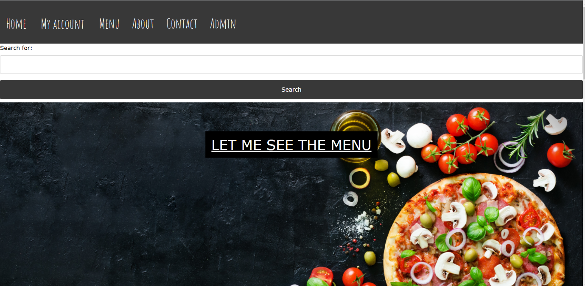
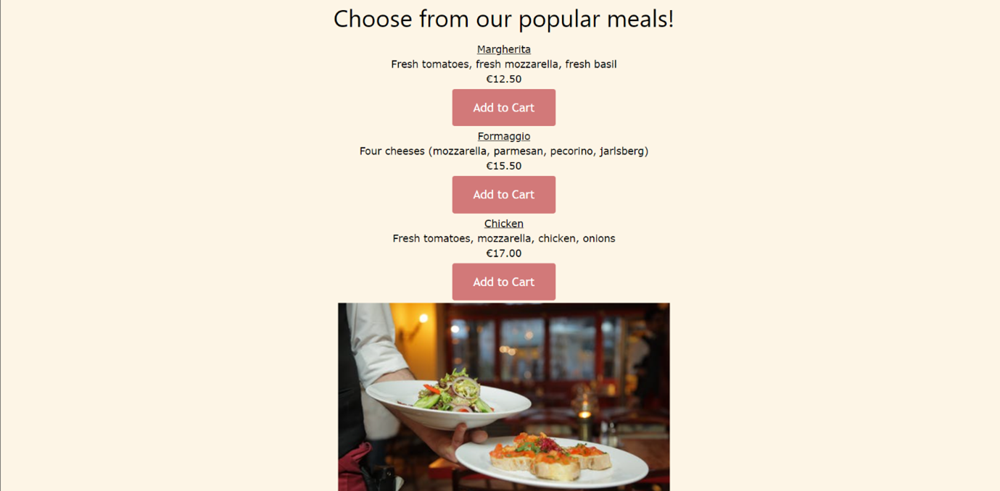
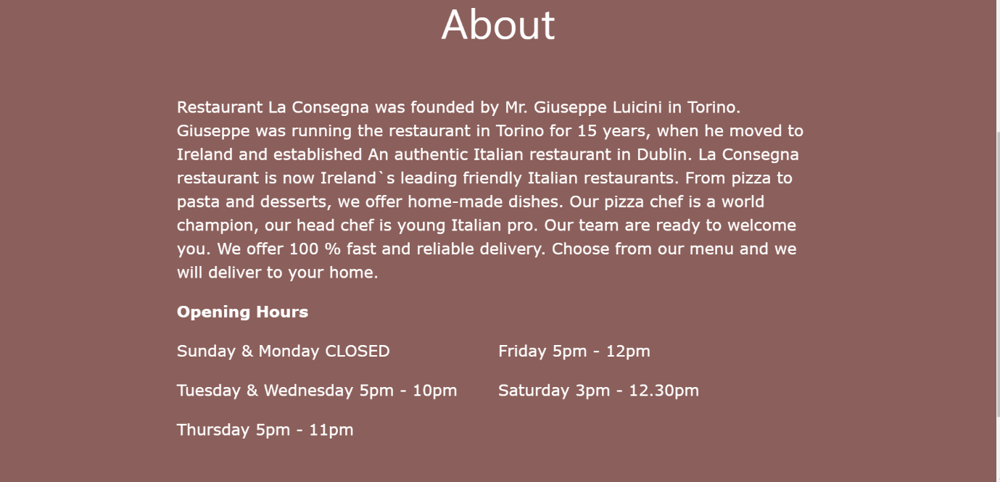
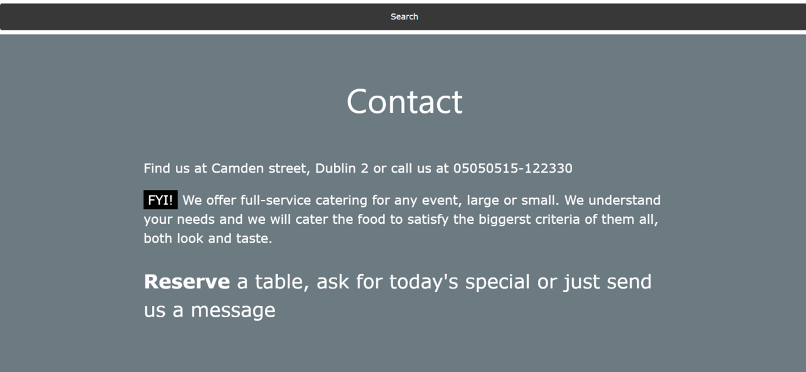
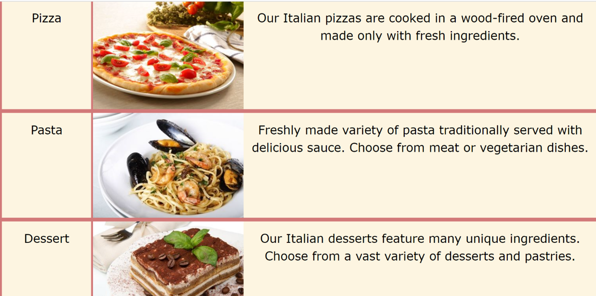
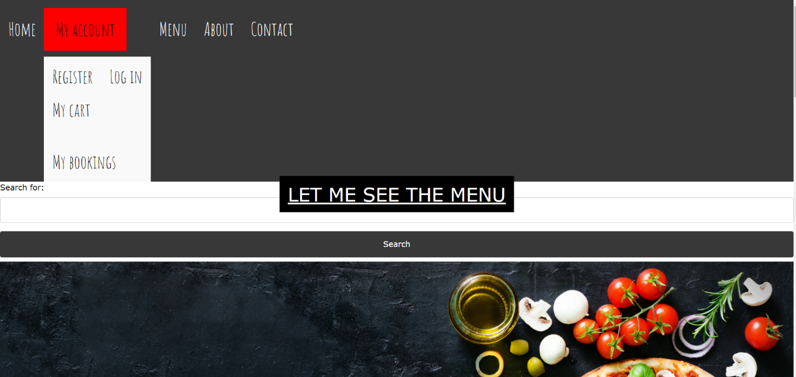
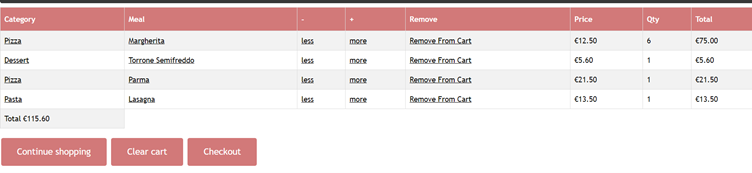

# La Consegna - Ordering Meal E-commerce Web Application

La Consegna App (meaning Delivery) is an E-commerce web application designed to order food online. 
It is implemented using Ruby on Rails framework and it was built on AWS educate Cloud 9.

## Layout

### Home Page
The homepage of the website features a simple top Navigation bar, that directs users to the part of the site they wish to visit.  

### Popular Products Page
Part of the home page is a popular product page, which is created as a partial in the layout folder and rendered in the home page. The number of items to show on this page is limited to three.

### About Page
Users can find an inspiring story of La Consegna restaurant in About Page.

### Contact Page
Contact page is displaying contact information about the restaurant. 

### Category Page
Every category has a title, description and image. Its purpose is to search the item according to its category – pizza, pasta or dessert. When the user clicks on the pizza image, all the pizzas from the menu will be displayed to him/her.

### My Account Page
In the account section user has an opportunity to log in/log out, register, see their cart content (My Cart) and their order content (My Bookings). Log in/Register is used for logging in or registering to the new account in case the costumer would like to purchase their booking

### Cart Page

### Booking Page

 
 
 
 
